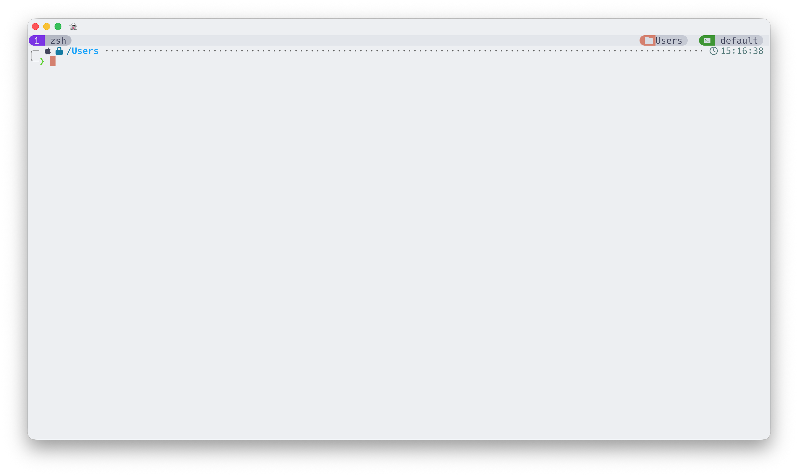
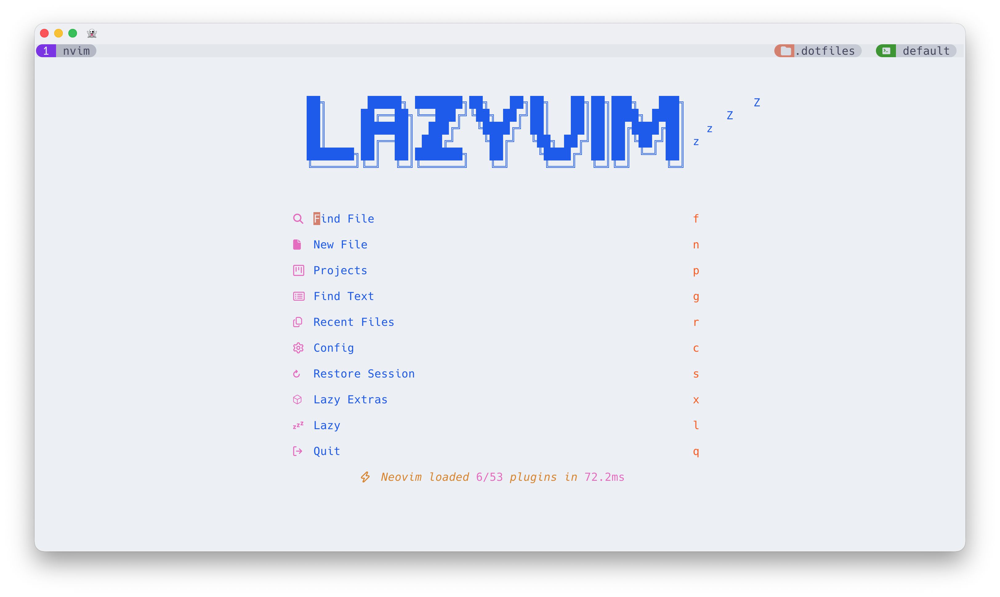
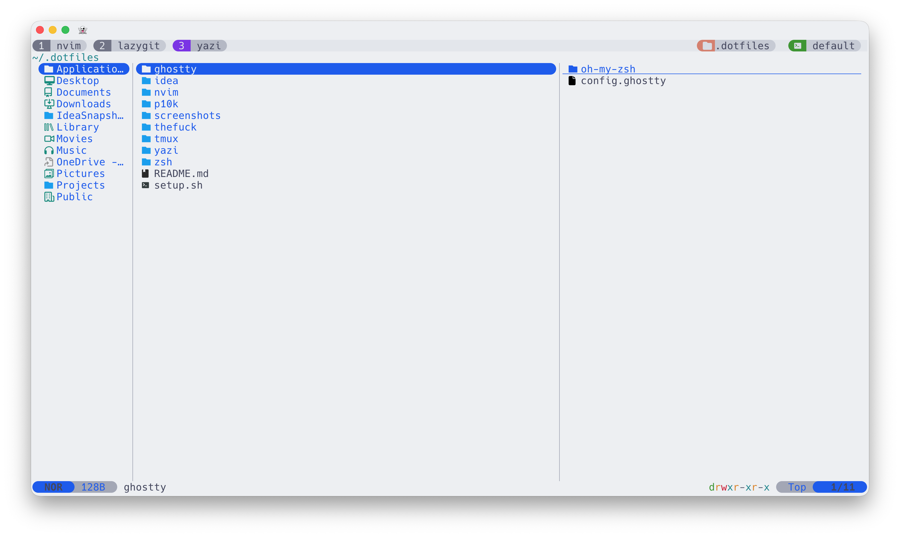
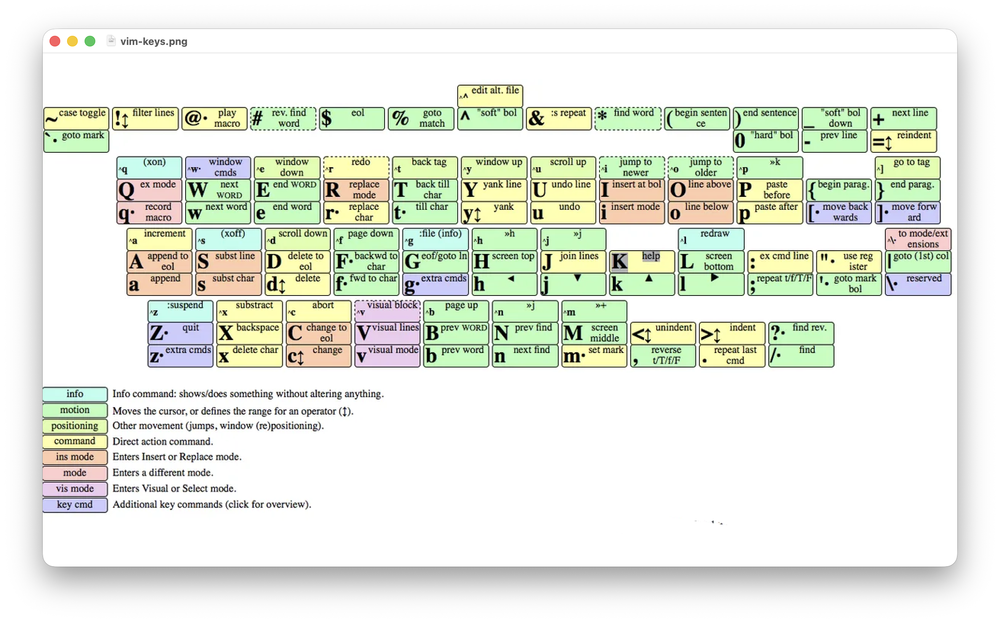

# dotfiles

Personal Windows/WSL2 dotfiles managed with [GNU Stow](https://www.gnu.org/software/stow/).

<table>
  <tr>
    <td></td>
    <td></td>
  </tr>
  <tr>
    <td align="center">Light mode (Catppuccin Latte)</td>
    <td align="center">Dark mode (Catppuccin Mocha)</td>
  </tr>
</table>

<table>
  <tr>
    <td></td>
    <td></td>
  </tr>
  <tr>
    <td align="center">Neovim with LazyVim</td>
    <td align="center">Lazygit</td>
  </tr>
</table>





## What's included

| Package | Config location | Description |
|---|---|---|
| `tmux` | `~/.config/tmux` | Tmux with Catppuccin theme, auto dark/light switching |
| `nvim` | `~/.config/nvim` | Neovim (LazyVim-based) with Catppuccin theme |
| `alacritty` | `%APPDATA%\alacritty` (Windows) | Alacritty terminal config + Oh My Zsh |
| `windows-terminal` | `%LOCALAPPDATA%\Packages\Microsoft.WindowsTerminal_8wekyb3d8bbwe\LocalState` (Windows) | Windows Terminal config (recommended for Windows 365) |
| `wezterm` | `%USERPROFILE%\.config\wezterm` (Windows) | WezTerm config for Windows 10/11 and Windows 365 |
| `yazi` | `~/.config/yazi` | Yazi file manager config |
| `thefuck` | `~/.config/thefuck` | Thefuck settings |
| `zsh` | `~/.zshrc`, `~/.zshenv`, `~/.zprofile` | Zsh config |
| `p10k` | `~/.p10k.zsh` | Powerlevel10k prompt config |
| `idea` | `~/.ideavimrc` | IdeaVim config for JetBrains IDEs |

---

## Setup

### 1. Enable WSL2

Open PowerShell as Administrator and run:

```powershell
wsl --install
```

Reboot when prompted.

### 2. Run the Windows setup script

Clone the repo on Windows, then run `setup-windows.ps1` from PowerShell as Administrator:

```powershell
Set-ExecutionPolicy -Scope CurrentUser RemoteSigned
git clone https://github.com/BearClumsy/dotfiles "$env:USERPROFILE\.dotfiles"
cd "$env:USERPROFILE\.dotfiles"
.\setup-windows.ps1
```

The script will ask which terminal to set up:

| Option | Terminal | Best for |
|---|---|---|
| 1 | **Alacritty** | Native Windows 10/11 |
| 2 | **WezTerm** | Native Windows 10/11 (GPU required) |
| 3 | **Windows Terminal** | Windows 365 / Cloud PC (no GPU) |

This script automatically:

- Installs the chosen terminal via winget
- Installs **Hack Nerd Font** for the current user
- Copies the terminal config to the correct location
- Verifies WSL is available

### 3. Run the Linux setup script inside WSL2

Open your terminal (it will launch WSL2), then run:

```bash
git clone https://github.com/BearClumsy/dotfiles ~/.dotfiles
bash ~/.dotfiles/setup-linux.sh
```

This script automatically:

- Creates all symlinks via **GNU Stow**
- Installs apt packages (`tmux`, `zsh`, `fzf`, `bat`, `jq`, `ripgrep`, `fd-find`, and more)
- Installs **Neovim** (latest, from GitHub releases)
- Installs **eza**, **lazygit**, **yazi**, **lazydocker**, **zoxide**
- Installs **thefuck**
- Installs **Oh My Zsh**, **Powerlevel10k**, **zsh-autosuggestions**
- Installs **TPM** (Tmux Plugin Manager)
- Sets zsh as the default shell

### 4. Install tmux plugins

Reopen your terminal, then inside tmux press `Ctrl+A` → `I`

### 5. Set up private config (optional)

Create a file for secrets and personal environment variables that won't be committed to git:

```bash
touch ~/.dotfiles/zsh/claude_config.zsh
```

Add your keys inside:

```bash
# API Keys
export ANTHROPIC_API_KEY="sk-ant-..."

# Other env vars
export EDITOR="nvim"
```

---

## Uninstall

To remove a terminal and its config, run `uninstall-windows.ps1` from PowerShell as Administrator:

```powershell
.\uninstall-windows.ps1
```

| Option | Terminal | What it does |
|---|---|---|
| 1 | **Alacritty** | Uninstalls via winget, removes `%APPDATA%\alacritty` |
| 2 | **WezTerm** | Uninstalls via winget, removes `%USERPROFILE%\.config\wezterm` |
| 3 | **Windows Terminal** | Deletes `settings.json` — Windows Terminal regenerates defaults on next launch |

---

## How it works

### Symlink management

[GNU Stow](https://www.gnu.org/software/stow/) creates symlinks from `~/.dotfiles/` into their expected locations. Configuration lives in `.stowrc`:

- Packages `alacritty`, `nvim`, `thefuck`, `tmux` → symlinked into `~/.config/`
- Packages `zsh`, `p10k`, `idea` → symlinked into `~/` (run via `setup-linux.sh`)

### Tmux auto theme switching

The tmux bar automatically switches between **Catppuccin Latte** (light) and **Catppuccin Mocha** (dark) when the Windows appearance changes. This is powered by the `tmux-dark-notify` plugin, which polls the system theme via WSL2.

### Zsh + Oh My Zsh

Oh My Zsh is only loaded when using **Alacritty** or **WezTerm** (detected via an env var set in the terminal config). In any other terminal a minimal zsh config is used instead.

### Neovim

LazyVim-based config. Plugins are installed automatically on first launch via `lazy.nvim`.
